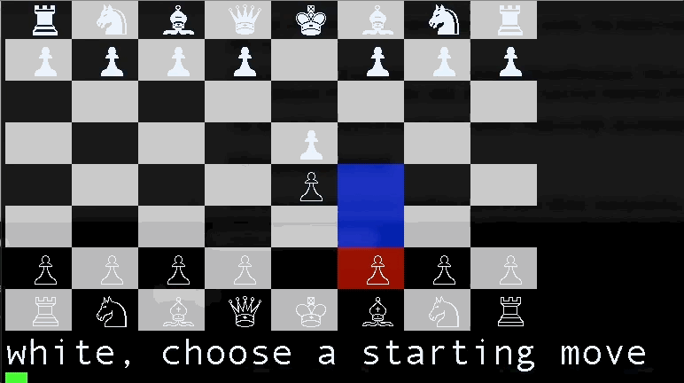
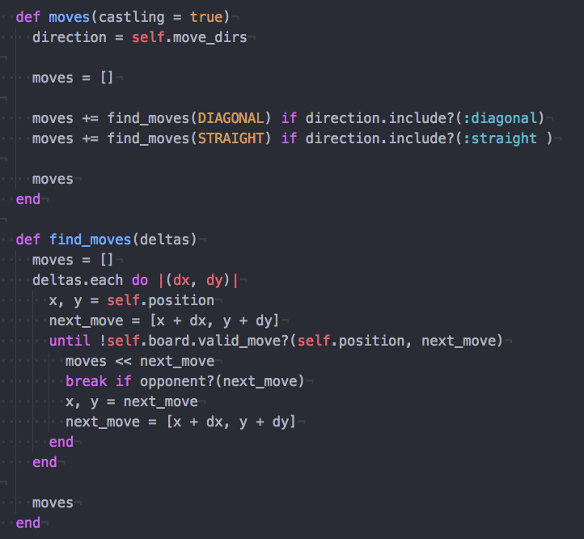
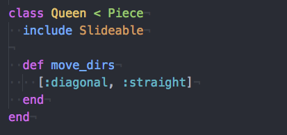
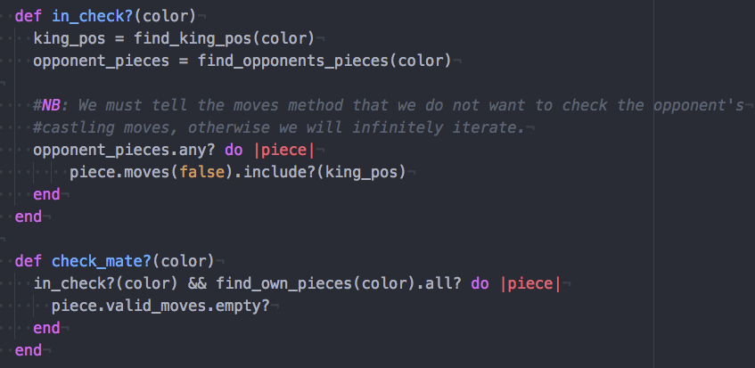

# README

## Overview
Chess is a terminal version of the popular game chess, coded in Ruby.

  

## Instructions
-  Clone the Repo.
-  In the root-directory in terminal, type 'ruby chess.rb.'

## Features
- User friendly color-highlighting of possible moves.
- Move pieces based on the established rules of the game.
- Capture pieces when appropriate.
- Check and checkmate capabilities.
- Implementation of special moves, such as castling.

## Object Orientation Highlights

### Slidable and Stepable Modules for Dry and Extensible Code.
Each slidable/stepable piece responds with its own move directions or steps respectively, and through this the stepable modules dynamically generates a piece's valid move.
This implementation allows for a standardized, easy to read approach to the complicated rules of chess.

  
  

### Simple and Clean Implementation of check and checkmate.
My object orientated approach allows for us to easily check the board for check and checkmate.
For in-check, I look if any of the opponents moves(other than castling) include the kings position.
For checkmate, I check if I am currently in check and have no valid moves(with the stipulation that a valid move cannot leave me/put me in check.)
In separating concerns, I provide easy to read code

  
